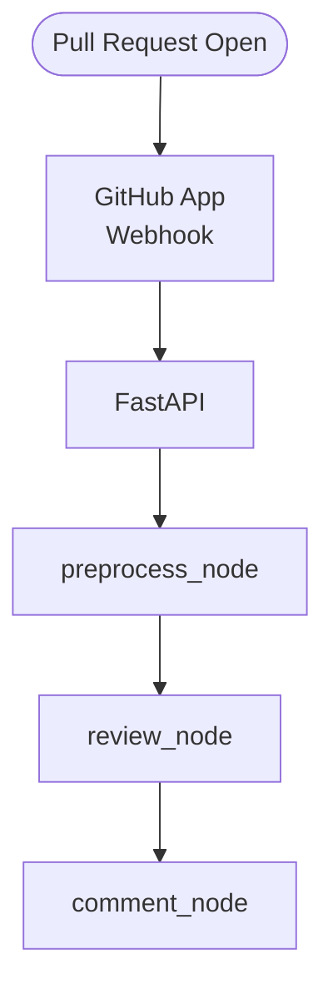

## 코드리뷰 봇 프로젝트
GitHub 에서 사용자가 Pull Request를 열었을 때 코드 리뷰 후 comment를 달아주는 bot 프로젝트

## 주요기능
1. Web hook으로 PR 이벤트 수신
2. 코드 변경 사항 조회
3. 필요 시 전체 코드 조회
4. 팀 컨벤션 문서 조회 (RAG)
5. 코드 리뷰 
6. PR comment 등록

## 구조도


## 프로젝트 구조
```
.
├── README.md
├── app
│   ├── api
│   │   └── webhook_router.py
│   ├── core
│   │   └── vectordb.py
│   ├── main.py
│   ├── repositories
│   │   └── retriever.py
│   ├── schemas
│   │   ├── response.py
│   │   └── state.py
│   └── services
│       ├── agents.py
│       ├── builder.py
│       ├── github_service.py
│       ├── nodes.py
│       ├── prompts.py
│       └── tools.py
├── chroma_db
├── data
├── docs
├── ingest.py
├── pyproject.toml
├── secret
└── uv.lock
```