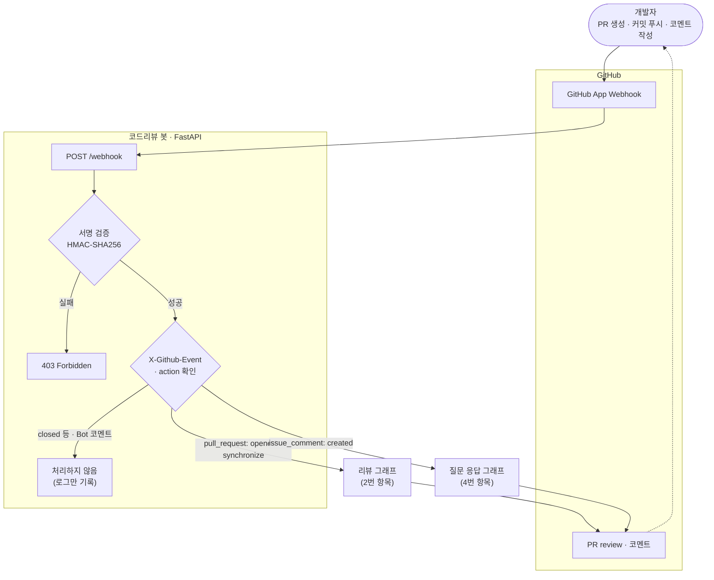
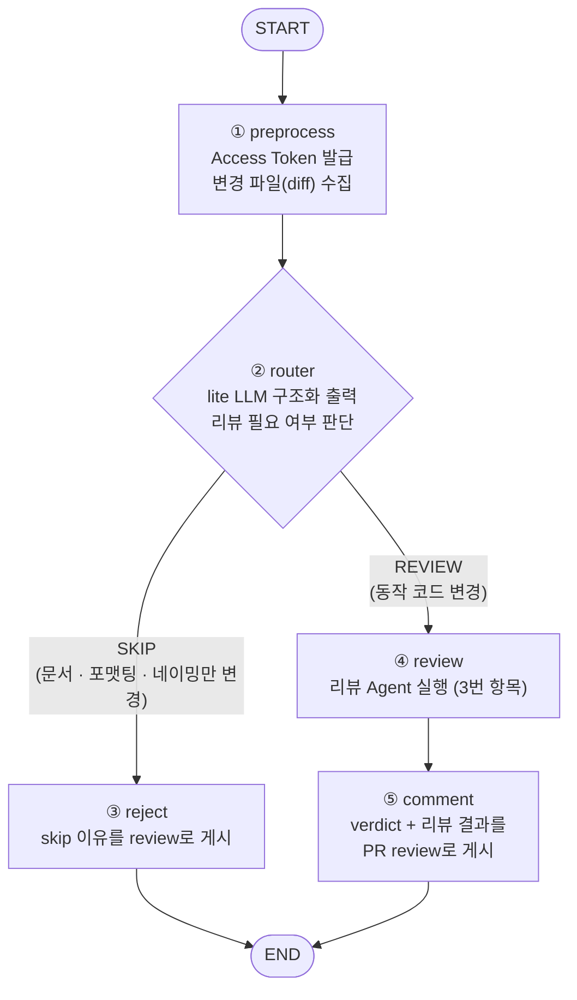
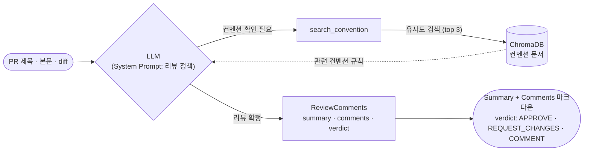
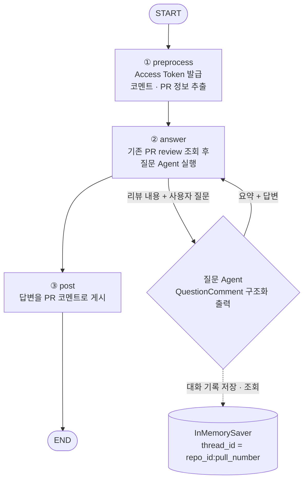
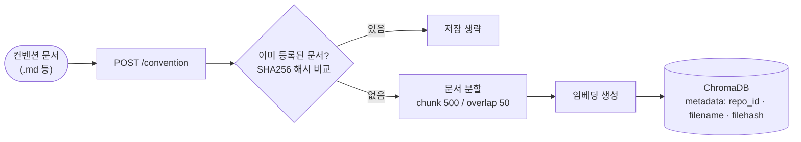

## 코드리뷰 봇 프로젝트
GitHub 에서 사용자가 Pull Request를 열었을 때 코드 리뷰 후 comment를 달아주는 bot 프로젝트

## 주요기능
1. Web hook으로 PR / PR comment 이벤트 수신
2. 코드 변경 사항 조회
3. 리뷰가 필요한 변경인지 LLM으로 판단 (문서·포맷팅 변경은 skip)
4. 팀 컨벤션 문서 조회 (RAG)
5. 코드 리뷰 및 PR review 등록
6. 리뷰에 대한 사용자 질문에 답변 (PR comment)

## 구조도
### 시스템 아키텍처


### 1. 전체 흐름
개발자가 PR을 올리거나 리뷰에 질문 코멘트를 남기면, 이벤트 종류에 따라 서로 다른 LangGraph 워크플로우가 실행됩니다.


```mermaid
flowchart TD
    DEV(["개발자<br/>PR 생성 · 커밋 푸시 · 코멘트 작성"])

    subgraph GITHUB["GitHub"]
        WH["GitHub App Webhook"]
        CM["PR review · 코멘트"]
    end

    subgraph BOT["코드리뷰 봇 · FastAPI"]
        EP["POST /webhook"]
        SIG{"서명 검증<br/>HMAC-SHA256"}
        REJ["403 Forbidden"]
        EV{"X-Github-Event<br/>· action 확인"}
        NOP["처리하지 않음<br/>(로그만 기록)"]
    end

    RG["리뷰 그래프<br/>(2번 항목)"]
    QG["질문 응답 그래프<br/>(4번 항목)"]

    DEV --> WH --> EP --> SIG
    SIG -- 실패 --> REJ
    SIG -- 성공 --> EV
    EV -- "closed 등 · Bot 코멘트" --> NOP
    EV -- "pull_request: opened · synchronize" --> RG
    EV -- "issue_comment: created" --> QG
    RG --> CM
    QG --> CM
    CM -.-> DEV
```

### 2. 리뷰 그래프 (pull_request 이벤트)
diff를 모은 뒤 리뷰가 필요한 변경인지 먼저 판단하고, 필요한 경우에만 리뷰 Agent를 실행합니다.


```mermaid
flowchart TD
    S(["START"])
    N1["① preprocess<br/>Access Token 발급<br/>변경 파일(diff) 수집"]
    N2{"② router<br/>lite LLM 구조화 출력<br/>리뷰 필요 여부 판단"}
    N3["③ reject<br/>skip 이유를 review로 게시"]
    N4["④ review<br/>리뷰 Agent 실행 (3번 항목)"]
    N5["⑤ comment<br/>verdict + 리뷰 결과를<br/>PR review로 게시"]
    E(["END"])

    S --> N1 --> N2
    N2 -- "SKIP<br/>(문서 · 포맷팅 · 네이밍만 변경)" --> N3 --> E
    N2 -- "REVIEW<br/>(동작 코드 변경)" --> N4 --> N5 --> E
```

### 3. 리뷰 Agent 내부 (ReAct)
`review` 노드가 호출하는 Agent는 필요할 때 스스로 컨벤션 문서를 검색하고, 더 볼 것이 없으면 리뷰를 확정합니다.


```mermaid
flowchart LR
    IN(["PR 제목 · 본문 · diff"]) --> LLM

    LLM{"LLM<br/>(System Prompt: 리뷰 정책)"}
    TOOL["search_convention"]
    DB[("ChromaDB<br/>컨벤션 문서")]
    OUT["ReviewComments<br/>summary · comments · verdict"]
    MD(["Summary + Comments 마크다운<br/>verdict: APPROVE · REQUEST_CHANGES · COMMENT"])

    LLM -- "컨벤션 확인 필요" --> TOOL
    TOOL -- "유사도 검색 (top 3)" --> DB
    DB -. "관련 컨벤션 규칙" .-> LLM
    LLM -- "리뷰 확정" --> OUT --> MD
```

> comments는 severity(high → medium → low) 순으로 정렬되며, verdict가 `REQUEST_CHANGES`면 summary에 경고 문구가 덧붙습니다.

### 4. 질문 응답 그래프 (issue_comment 이벤트)
개발자가 PR에 코멘트로 질문하면, 봇이 남긴 리뷰 내용을 근거로 답변합니다.


```mermaid
flowchart TD
    S(["START"])
    N1["① preprocess<br/>Access Token 발급<br/>코멘트 · PR 정보 추출"]
    N2["② answer<br/>기존 PR review 조회 후<br/>질문 Agent 실행"]
    N3["③ post<br/>답변을 PR 코멘트로 게시"]
    E(["END"])
    AG{"질문 Agent<br/>QuestionComment 구조화 출력"}
    MEM[("InMemorySaver<br/>thread_id = repo_id:pull_number")]

    S --> N1 --> N2 --> N3 --> E
    N2 -- "리뷰 내용 + 사용자 질문" --> AG
    AG -- "요약 + 답변" --> N2
    AG -. "대화 기록 저장 · 조회" .-> MEM
```

> PR 하나를 하나의 대화로 취급합니다. 질문 Agent는 `thread_id = {repo_id}:{pull_number}` 로 대화 기록을 유지하므로 이어지는 질문도 문맥이 유지됩니다. (프로세스 메모리에 저장되므로 재시작 시 초기화됩니다.)

### 5. 컨벤션 문서 등록 (RAG 인덱싱)
리뷰에 사용할 팀 컨벤션 문서를 미리 벡터 DB에 넣어 두는 별도 흐름입니다.


```mermaid
flowchart LR
    FILE(["컨벤션 문서<br/>(.md 등)"]) --> API["POST /convention"]
    API --> HASH{"이미 등록된 문서?<br/>SHA256 해시 비교"}
    HASH -- 있음 --> SKIP["저장 생략"]
    HASH -- 없음 --> SPLIT["문서 분할<br/>chunk 500 / overlap 50"]
    SPLIT --> EMB["임베딩 생성"]
    EMB --> DB[("ChromaDB<br/>metadata: repo_id · filename · filehash")]
```

## 프로젝트 구조
```
.
├── Dockerfile
├── README.md
├── app
│   ├── api
│   │   ├── convention_router.py
│   │   ├── deps.py
│   │   └── webhook_router.py
│   ├── core
│   │   ├── config.py
│   │   ├── container.py
│   │   ├── embedding.py
│   │   ├── llm.py
│   │   └── vectordb.py
│   ├── main.py
│   ├── repositories
│   │   └── vector_repository.py
│   ├── schemas
│   │   ├── response.py
│   │   └── state.py
│   └── services
│       ├── agents.py
│       ├── builder.py
│       ├── convention_service.py
│       ├── edges.py
│       ├── github_service.py
│       ├── nodes.py
│       ├── prompts.py
│       └── tools.py
├── docker-compose.yml
├── docs
├── nginx.conf
├── pyproject.toml
├── test
│   ├── conftest.py
│   ├── test_convention_service.py
│   ├── test_llm.py
│   └── test_main.py
└── uv.lock
```

## 예시 화면

