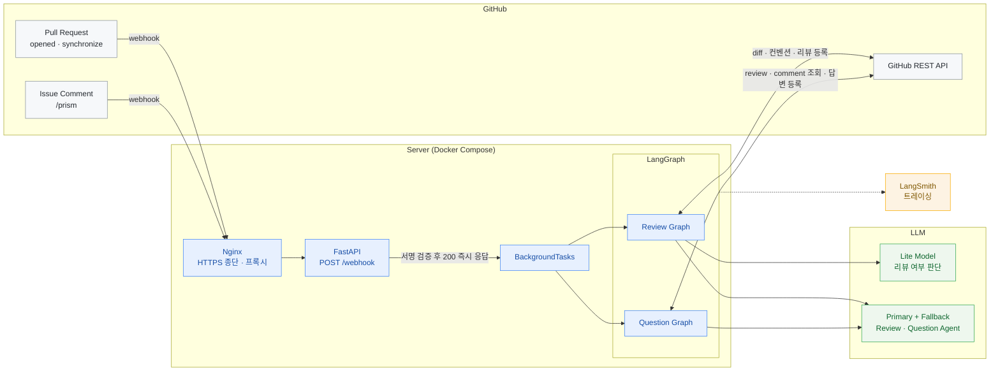
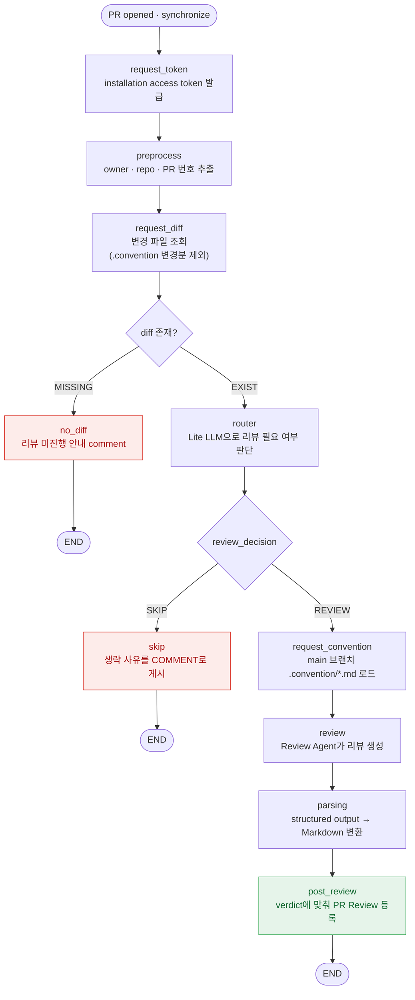
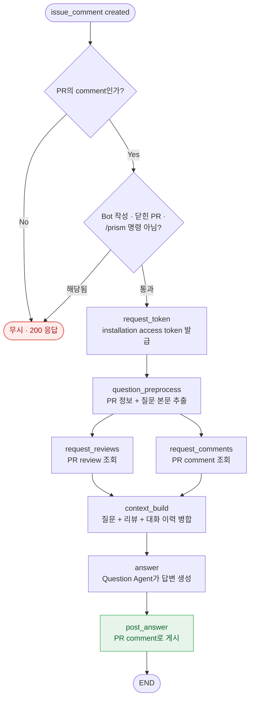

# 코드리뷰 봇 프로젝트


## 개요

**Prism**은 GitHub Pull Request가 열리는 순간 자동으로 코드 리뷰를 남기는 GitHub App입니다.

저장소에 앱을 설치하는 것만으로 사용할 수 있으며, 

워크플로 파일 작성이나 CI 파이프라인 수정은 필요하지 않습니다.

### 문제 정의

코드 리뷰는 결함을 조기에 발견하고 코드 품질을 유지하는 가장 확실한 장치지만, 리뷰를 요청하는 것에 어려움이 있습니다.

- **1인 개발 · 사이드 프로젝트** : 리뷰를 요청할 동료가 없어, 작성자 본인의 시야 밖에 있는 문제는 끝내 발견되지 않은 채 병합됩니다.
- **소규모 팀** : 리뷰 요청이 특정 인원에게 집중되어 병목이 발생하고, PR이 며칠씩 대기 상태로 남습니다.
- **컨벤션 준수** : 팀 컨벤션을 문서로 정리해 두어도, 매 리뷰에서 일관되게 확인되기는 어렵습니다.

결과적으로 리뷰를 받고 싶어도 받을 수 없는 상황이 반복되고, 검증되지 않은 변경 사항이 그대로 메인 브랜치에 누적됩니다.

### 해결 방식

Prism은 **리뷰어의 부재를 메우는 것**을 목표로 합니다.

| | 내용 |
|---|---|
| **간편한 도입** | GitHub App 설치 한 번으로 적용. 워크플로 파일·토큰 발급·별도 배포 불필요 |
| **즉시 리뷰** | PR 생성 및 커밋 추가 시점에 변경 사항을 분석해 리뷰 등록. 리뷰어를 기다리지 않음 |
| **팀 컨벤션 반영** | 저장소 `.convention` 디렉토리의 문서를 리뷰 기준으로 함께 적용해, 문서로만 존재하던 규칙을 실제 리뷰에 반영 |
| **불필요한 리뷰 억제** | 문서 수정·포맷팅 등 리뷰 가치가 낮은 변경은 경량 모델이 사전에 판별해 생략. 알림 피로와 호출 비용을 절감 |
| **대화형 후속 질문** | 리뷰 내용이 이해되지 않을 때 PR 댓글에 `/prism` 으로 질문하면, 기존 리뷰 맥락을 유지한 답변을 제공 |

### 기대 효과

- 리뷰어 유무와 무관하게 **모든 PR에 최소 1회의 리뷰를 보장**
- 리뷰 대기 시간 제거를 통한 **개발 사이클 단축**
- 컨벤션의 **문서화 수준에서 실제 적용 수준으로의 전환**

## 관련 링크
- 서비스 주소
    https://vicki.ai.kr/
- 프론트엔드
    https://github.com/Ryuharam/prism-fe

## 주요기능
1. Web hook으로 PR / PR comment 이벤트 수신
2. 코드 변경 사항 조회
3. 리뷰가 필요한 변경인지 LLM으로 판단 (문서·포맷팅 변경은 skip)
4. 팀 컨벤션 문서 조회 
5. 코드 리뷰 및 PR review 등록
6. 리뷰에 대한 사용자 질문에 답변 (PR comment)

## 영상 포트폴리오

<!-- 아래 이미지를 클릭하면 영상으로 이동합니다. 썸네일은 16:9 가로 이미지를 권장합니다. -->
<a href="영상_링크">
  
</a>

## 서비스 스크린 샷

### 서비스 소개 페이지


### 코드 리뷰 결과


### `/prism` 질문 & 답변


## 아키텍처


```mermaid
flowchart LR
    subgraph GH["GitHub"]
        PR["Pull Request<br/>opened · synchronize"]
        CM["Issue Comment<br/>/prism"]
        API["GitHub REST API"]
    end

    subgraph SERVER["Server (Docker Compose)"]
        NGINX["Nginx<br/>HTTPS 종단 · 프록시"]
        APP["FastAPI<br/>POST /webhook"]
        BG["BackgroundTasks"]
        subgraph GRAPH["LangGraph"]
            RG["Review Graph"]
            QG["Question Graph"]
        end
    end

    subgraph MODEL["LLM"]
        LITE["Lite Model<br/>리뷰 여부 판단"]
        MAIN["Primary + Fallback<br/>Review · Question Agent"]
    end

    OBS["LangSmith<br/>트레이싱"]

    PR -- webhook --> NGINX
    CM -- webhook --> NGINX
    NGINX --> APP
    APP -- "서명 검증 후 200 즉시 응답" --> BG
    BG --> RG
    BG --> QG
    RG <-- "diff · 컨벤션 · 리뷰 등록" --> API
    QG <-- "review · comment 조회 · 답변 등록" --> API
    RG --> LITE
    RG --> MAIN
    QG --> MAIN
    GRAPH -.-> OBS

    classDef gh fill:#f6f8fa,stroke:#8b949e,color:#24292f
    classDef srv fill:#e7f0fe,stroke:#4285f4,color:#174ea6
    classDef llm fill:#eef7ee,stroke:#34a853,color:#0d652d
    classDef obs fill:#fdf3e3,stroke:#f9ab00,color:#7f5700
    class PR,CM,API gh
    class NGINX,APP,BG,RG,QG srv
    class LITE,MAIN llm
    class OBS obs
```

- **Nginx** : HTTPS 종단, FastAPI로 프록시
- **FastAPI** : 웹훅 서명(`x-hub-signature-256`) 검증 후 이벤트를 분기하고, GitHub의 재전송을 막기 위해 **먼저 200을 응답**한 뒤 그래프를 백그라운드로 실행
- **LangGraph** : 리뷰용 / 질문용 그래프 2개를 부팅 시점에 컴파일해 재사용 (`app/core/container.py`)
- **LLM** : diff 훑기용 경량 모델과 실제 리뷰·답변 생성용 모델을 분리, primary 실패 시 fallback으로 전환

## 요청 처리 흐름

### 1. PR이 등록됐을 때 (`pull_request` : opened / synchronize)


```mermaid
flowchart TD
    S(["PR opened · synchronize"]) --> T["request_token<br/>installation access token 발급"]
    T --> P["preprocess<br/>owner · repo · PR 번호 추출"]
    P --> D["request_diff<br/>변경 파일 조회<br/>(.convention 변경분 제외)"]
    D --> C1{"diff 존재?"}
    C1 -- MISSING --> ND["no_diff<br/>리뷰 미진행 안내 comment"]
    ND --> E1([END])
    C1 -- EXIST --> R["router<br/>Lite LLM으로 리뷰 필요 여부 판단"]
    R --> C2{"review_decision"}
    C2 -- SKIP --> SK["skip<br/>생략 사유를 COMMENT로 게시"]
    SK --> E2([END])
    C2 -- REVIEW --> CV["request_convention<br/>main 브랜치 .convention/*.md 로드"]
    CV --> RV["review<br/>Review Agent가 리뷰 생성"]
    RV --> PS["parsing<br/>structured output → Markdown 변환"]
    PS --> PO["post_review<br/>verdict에 맞춰 PR Review 등록"]
    PO --> E3([END])

    classDef skip fill:#fdecea,stroke:#d93025,color:#a50e0e
    classDef done fill:#e6f4ea,stroke:#34a853,color:#0d652d
    class ND,SK skip
    class PO done
```

- 문서·포맷팅만 바뀐 PR은 `router`에서 걸러 **리뷰 없이 사유만 남깁니다.**
- 컨벤션 문서가 없거나 `.md`가 아닌 파일이 섞여 있으면, 리뷰는 그대로 진행하되 Summary에 안내 문구를 덧붙입니다.

### 2. `/prism`으로 사용자가 질문했을 때 (`issue_comment` : created)


```mermaid
flowchart TD
    S(["issue_comment created"]) --> G1{"PR의 comment인가?"}
    G1 -- No --> X([무시 · 200 응답])
    G1 -- Yes --> G2{"Bot 작성 · 닫힌 PR ·<br/>/prism 명령 아님?"}
    G2 -- 해당됨 --> X
    G2 -- 통과 --> T["request_token<br/>installation access token 발급"]
    T --> P["question_preprocess<br/>PR 정보 + 질문 본문 추출"]
    P --> RQ["request_reviews<br/>PR review 조회"]
    P --> RC["request_comments<br/>PR comment 조회"]
    RQ --> CB["context_build<br/>질문 + 리뷰 + 대화 이력 병합"]
    RC --> CB
    CB --> A["answer<br/>Question Agent가 답변 생성"]
    A --> PA["post_answer<br/>PR comment로 게시"]
    PA --> E([END])

    classDef skip fill:#fdecea,stroke:#d93025,color:#a50e0e
    classDef done fill:#e6f4ea,stroke:#34a853,color:#0d652d
    class X skip
    class PA done
```

- `request_reviews`와 `request_comments`는 **병렬로 실행**되어 두 조회가 끝난 뒤 `context_build`에서 합쳐집니다.
- 봇 자신의 comment는 무시하므로 답변이 다시 웹훅을 부르는 루프가 생기지 않습니다.

## 디렉토리 구조
```
.
├── Dockerfile
├── README.md
├── app
│   ├── api
│   │   ├── deps.py               # FastAPI 의존성 주입 (Container 주입)
│   │   └── webhook_router.py     # POST /webhook - 서명 검증 · 이벤트 분기 · 그래프 실행
│   ├── core
│   │   ├── config.py             # .env 기반 설정 (pydantic-settings)
│   │   ├── container.py          # 의존성 조립 지점 (부팅 시 1회, 실패 시 fail fast)
│   │   └── llm.py                # LLM 생성 · primary/fallback 체인 구성
│   ├── exceptions
│   │   ├── custom_exception.py   # 도메인 예외 정의
│   │   └── handler.py            # 전역 예외 핸들러 (에러 응답 형식 통일)
│   ├── graph
│   │   ├── agents.py             # review · question agent 정의 (structured output)
│   │   ├── builder.py            # LangGraph 그래프 조립 (노드 · 엣지 연결)
│   │   ├── edges.py              # 조건부 엣지 (diff 존재 여부 · 리뷰 여부 분기)
│   │   ├── nodes.py              # 그래프 각 단계의 실제 처리 로직
│   │   └── prompts.py            # 시스템 프롬프트 모음
│   ├── logging_config.py         # 로깅 포맷 · 레벨 · 파일 핸들러 설정
│   ├── main.py                   # FastAPI 앱 진입점 (lifespan에서 Container 생성)
│   ├── schemas
│   │   ├── response.py           # LLM 응답 스키마 (리뷰 · 답변 구조 정의)
│   │   └── state.py              # 그래프 State · Context 스키마
│   └── services
│       └── github_service.py     # GitHub API 클라이언트 (토큰 발급 · 조회 · 등록)
├── docker-compose.yml            # nginx + app 컨테이너 구성
├── docs                          # 개발 회고 · 문서
├── nginx.conf                    # HTTPS 종단 · 리버스 프록시 설정
├── pyproject.toml                # 프로젝트 메타데이터 · 의존성 (uv)
├── test
└── uv.lock
```

## 실행 방법
1. 루트 디렉토리에 `.env` 생성
```bash
# ── GitHub App ────────────────────────────────
WEBHOOK_SECRET=                              # 웹훅 서명(x-hub-signature-256) 검증용 시크릿
GITHUB_CLIENT_ID=                            # GitHub App의 Client ID (JWT 발급에 사용)
GITHUB_KEY_FILE_PATH=                        # GitHub App 개인 키(.pem) 경로

# ── LLM ───────────────────────────────────────
LLM_PRIMARY=google_genai:gemini-2.5-flash    # 리뷰·답변 생성 주 모델 (provider:model 형식)
LLM_FALLBACKS=                               # rate limit 시 대체할 모델, 쉼표로 구분 (없으면 비워둠)
LITE_MODEL=                                  # 리뷰 필요 여부 판단용 경량 모델

GOOGLE_API_KEY=                              # google_genai 사용 시 필수
ANTHROPIC_API_KEY=                           # anthropic 사용 시 필수

# ── 배포 ──────────────────────────────────────
DOCKER_USERNAME=                             # docker-compose가 참조하는 이미지 네임스페이스

# ── 관측 ──────────────────────────────────────
LANGSMITH_TRACING=true                       # LangSmith 트레이싱 활성화 여부
LANGSMITH_API_KEY=                           # LangSmith API 키
LANGSMITH_PROJECT=                           # 트레이스가 기록될 프로젝트명

LOG_LEVEL=INFO                               # 로그 레벨 (DEBUG / INFO / WARNING / ERROR)
```
2. uv 실행

    - `uv run --env-file .env uvicorn app.main:app --reload`

