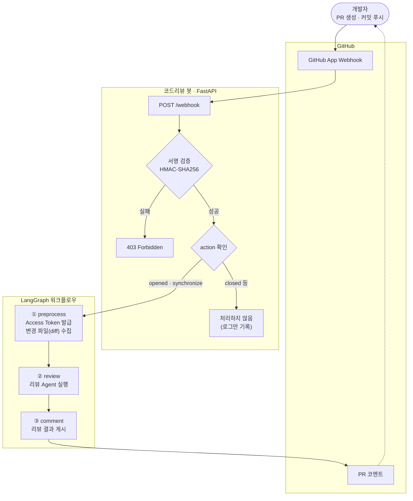
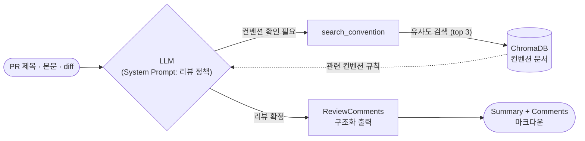

## 코드리뷰 봇 프로젝트
GitHub 에서 사용자가 Pull Request를 열었을 때 코드 리뷰 후 comment를 달아주는 bot 프로젝트

## 주요기능
1. Web hook으로 PR 이벤트 수신
2. 코드 변경 사항 조회
3. 팀 컨벤션 문서 조회 (RAG)
4. 코드 리뷰 
5. PR comment 등록

## 구조도

### 1. 전체 흐름
개발자가 PR을 올리면 봇이 리뷰 코멘트를 달기까지의 과정입니다.


```mermaid
flowchart TD
    DEV(["개발자<br/>PR 생성 · 커밋 푸시"])

    subgraph GITHUB["GitHub"]
        WH["GitHub App Webhook"]
        CM["PR 코멘트"]
    end

    subgraph BOT["코드리뷰 봇 · FastAPI"]
        EP["POST /webhook"]
        SIG{"서명 검증<br/>HMAC-SHA256"}
        REJ["403 Forbidden"]
        ACT{"action 확인"}
        NOP["처리하지 않음<br/>(로그만 기록)"]
    end

    subgraph GRAPH["LangGraph 워크플로우"]
        N1["① preprocess<br/>Access Token 발급<br/>변경 파일(diff) 수집"]
        N2["② review<br/>리뷰 Agent 실행"]
        N3["③ comment<br/>리뷰 결과 게시"]
    end

    DEV --> WH --> EP --> SIG
    SIG -- 실패 --> REJ
    SIG -- 성공 --> ACT
    ACT -- "closed 등" --> NOP
    ACT -- "opened · synchronize" --> N1
    N1 --> N2 --> N3 --> CM
    CM -.-> DEV
```

### 2. 리뷰 Agent 내부 (ReAct)
`review` 노드가 호출하는 Agent는 필요할 때 스스로 컨벤션 문서를 검색하고, 더 볼 것이 없으면 리뷰를 확정합니다.


```mermaid
flowchart LR
    IN(["PR 제목 · 본문 · diff"]) --> LLM

    LLM{"LLM<br/>(System Prompt: 리뷰 정책)"}
    TOOL["search_convention"]
    DB[("ChromaDB<br/>컨벤션 문서")]
    OUT["ReviewComments<br/>구조화 출력"]
    MD(["Summary + Comments<br/>마크다운"])

    LLM -- "컨벤션 확인 필요" --> TOOL
    TOOL -- "유사도 검색 (top 3)" --> DB
    DB -. "관련 컨벤션 규칙" .-> LLM
    LLM -- "리뷰 확정" --> OUT --> MD
```

> PR 하나를 하나의 대화로 취급합니다. `thread_id = {repo_id}:{pull_number}` 로 대화 기록을 유지합니다.

### 3. 컨벤션 문서 등록 (RAG 인덱싱)
리뷰에 사용할 팀 컨벤션 문서를 미리 벡터 DB에 넣어 두는 별도 흐름입니다.


```mermaid
flowchart LR
    FILE(["컨벤션 문서<br/>(.md 등)"]) --> API["POST /convention"]
    API --> HASH{"이미 등록된 문서?<br/>SHA256 해시 비교"}
    HASH -- 있음 --> SKIP["저장 생략"]
    HASH -- 없음 --> SPLIT["문서 분할<br/>chunk 500 / overlap 50"]
    SPLIT --> EMB["임베딩 생성"]
    EMB --> DB[("ChromaDB<br/>metadata: repo_id · filename · filehash")]
```

## 프로젝트 구조
```
.
├── Dockerfile
├── README.md
├── app
│   ├── api
│   │   ├── convention_router.py
│   │   ├── deps.py
│   │   └── webhook_router.py
│   ├── core
│   │   ├── config.py
│   │   ├── container.py
│   │   ├── embedding.py
│   │   ├── llm.py
│   │   └── vectordb.py
│   ├── main.py
│   ├── repositories
│   │   └── vector_repository.py
│   ├── schemas
│   │   ├── response.py
│   │   └── state.py
│   └── services
│       ├── agents.py
│       ├── builder.py
│       ├── convention_service.py
│       ├── github_service.py
│       ├── nodes.py
│       ├── prompts.py
│       └── tools.py
├── docker-compose.yml
├── docs
├── nginx.conf
├── pyproject.toml
├── test
│   ├── conftest.py
│   ├── test_convention_service.py
│   ├── test_llm.py
│   └── test_main.py
└── uv.lock
```

## 예시 화면

